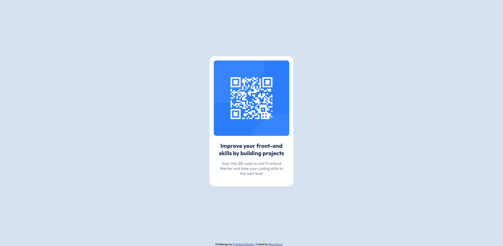

# Frontend Mentor - QR code component solution

This is a solution to the [QR code component challenge on Frontend Mentor](https://www.frontendmentor.io/challenges/qr-code-component-iux_sIO_H). Frontend Mentor challenges help you improve your coding skills by building realistic projects.

## Table of contents

- [Overview](#overview)
  - [Screenshot](#screenshot)
  - [Links](#links)
  - [Built with](#built-with)
  - [Useful resources](#useful-resources)
- [Author](#author)

## Overview

### Screenshot

### Links

- Solution URL: [Github](https://github.com/sgnovo/qr-code-component-main)
- Live Site URL: [Netlify](https://sgnovo-qr-code-component.netlify.app/)

### Built with

- Semantic HTML5 markup
- CSS custom properties
- Flexbox

### Useful resources

- [Centering in CSS: A Complete Guide](https://css-tricks.com/centering-css-complete-guide/) - This helped me for easily centering CSS elements.

## Author

- Website - [Novo Saga](https://github.com/sgnovo)
- Frontend Mentor - [@sgnovo](https://www.frontendmentor.io/profile/sgnovo)
